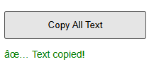

# Copy All Text Chrome Extension

Easily copy all visible text from any webpage with a single click! This lightweight Chrome extension is perfect for students, researchers, and anyone who needs to quickly grab all the text content from a site.

---

## 🚀 Features
- **One-click copy:** Instantly copies all text from the current page to your clipboard.
- **Simple UI:** Clean popup with a single button.
- **No ads, no tracking:** 100% privacy-friendly.

---

## 📸 Screenshots



---

## 🛠️ Installation

1. **Clone or download this repository.**
2. Open Chrome and go to `chrome://extensions/`.
3. Enable **Developer mode** (top right).
4. Click **Load unpacked** and select the `CopyAllTextExtension` folder.
5. The extension icon will appear in your toolbar.

---

## 💡 Usage
1. Open any webpage.
2. Click the extension icon.
3. Click **Copy All Text**.
4. Paste anywhere (Notepad, Word, etc.) — all page text is copied!

---

## 📁 Project Structure
```
CopyAllTextExtension/
├── manifest.json
├── popup.html
├── popup.js
├── icon.png
└── README.md
```

---

## 🤝 Contributing
Pull requests are welcome! For major changes, please open an issue first to discuss what you would like to change.

---

## 📄 License
This project is licensed under the MIT License.
